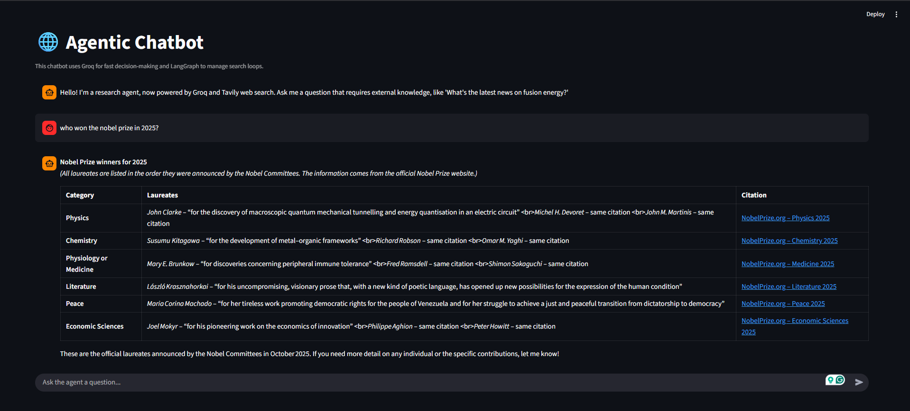

# ⚡ Groq-Powered Multi-Agent Architecture

&nbsp;
[](https://opensource.org/licenses/MIT) [](https://www.python.org/) []() []() []()




**The platform for reliable, high-speed AI agents.**

A comprehensive repository for building and deploying advanced AI agent systems, focusing on low-latency performance using the Groq API, architectural clarity (**ReAct**), and sophisticated inter-agent communication (**MCP**).

---

## 🏗️ Architectural Deep Dive

* **Chatbot with Groq API and Websearch:** Provides a core conversational loop using **Groq** for high-speed LLM inference, augmented by a **websearch** tool for real-time grounded information retrieval.
  
* **Tool Calling:** Implementation of function/tool calling capabilities, allowing agents to dynamically select and execute external logic to achieve complex goals.
  
* **ReAct (Reasoning and Acting) Agent:** The primary architectural loop that structures the agent's thought process into observable `Thought` (internal reasoning) and `Action` (tool execution).
* **Memory and Streaming (LangGraph):** Leverages *LangGraph* for managing complex state transitions and maintaining long-term conversational memory, with output streaming for enhanced user experience.
* **MCP (Multi-Agent Communication Protocol):** Includes both *MCP server* creation and *MCP client* development to enable structured, reliable communication between specialized agents.
* **Multi-Agent AI Chatbot:** The final system where specialized agents cooperate and delegate tasks to solve complex, multi-step queries.


---

## 🛠️ Setup and Installation

1.  **Clone the repository:**
    ```bash
    git clone [your_repo_link]
    cd groq-agent-architecture
    ```
2.  **Install dependencies:**
    ```bash
    uv add -r requirement.txt
    ```
3.  **Set Environment Variables:** Add API keys (e.g., `GROQ_API_KEY`) to a `.env` file.

---
